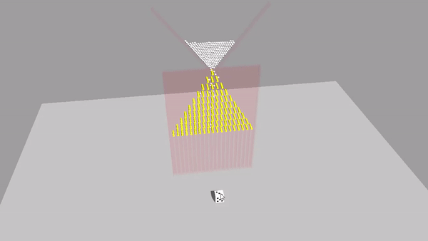

# [Taro](https://www.echou.xyz/taro/)

A lightweight 3D game engine for the web. Built with [three.js](https://github.com/mrdoob/three.js/) and [cannon-es](https://github.com/pmndrs/cannon-es).



## Documentation

You can find the Taro documentation [on the website](https://www.echou.xyz/taro/docs/#/).

## Examples

There are several examples [on the website](https://www.echou.xyz/taro/examples/#Cube). Here is an example to get started:
```javascript
var app = new TARO.App();
document.body.appendChild( app.domElement );

var scene = new TARO.Scene();
app.setScene(scene);

class CubeController {
  init() {
    // fires when the component is attached to an entity
    this.rotation = this.entity.rotation;
  }

  update() {
    // fires once per frame
    this.rotation.x += 0.01;
    this.rotation.y += 0.01;
  }
}

TARO.registerComponent('cubeController', CubeController);

var cube = new TARO.Entity('cube');
cube.addComponent('material', { color: 0x00ff00 });
cube.addComponent('geometry', { type: 'box' });
cube.addComponent('cubeController');

var camera = new TARO.Entity('camera');
camera.position.z = 5;
camera.addComponent('camera');

app.start();
```

This example will display a spinning cube on the canvas.

## Editor

In addition to the engine, there is a [visual editor](https://www.echou.xyz/taro/editor/) available to get a taste of Taro.

## License
[MIT License](https://github.com/Cloud9c/taro/blob/master/LICENSE)
