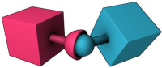
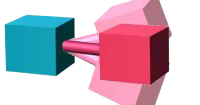
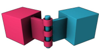
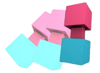

[Component](api/core/Component) ›

# Constraint
A constraint connects a Rigidbody to another Rigidbody or a fixed point in space. Constraints apply forces that move rigid bodies, and constraint limits restrict that movement. This is a wrapper class around cannon-es [Constraint](https://raw.githack.com/pmndrs/cannon-es/typedoc2/docs/classes/constraint.html) classes.

| Type      | Description                                                                     | Diagram                         |
|-----------|---------------------------------------------------------------------------------|---------------------------------|
| coneTwist | Unrestricted rotation (twist) on one axis, limited rotation (in cone) on others |      |
| distance  | Set bodies a fixed distance apart.                                              |    |
| hinge     | Single axis rotation.                                                           |          |
| lock      | Bodies act as one body.                                                         |            |
| point     | Multi axis rotation.                                                            |          |

## Code Example

```javascript
var entityA = new Entity();
entityA.addComponent('rigidbody');

var entityB = new Entity();
entityA.addComponent('rigidbody');
entityB.addComponent('constraint', {
	type: 'distance',
	connectedBody: entityA
});
```

## Data Parameters

| Property         | Description                                                                                                                      | Default Value |
|------------------|----------------------------------------------------------------------------------------------------------------------------------|---------------|
| collideConnected | Whether collision between connected bodies are allowed                                                                           | true          |
| connectedBody    | A reference to another entity this joint connects to. If not set then the joint connects the object to [0, 0, 0] in world space. | ""            |
| maxForce         | The maximum force that can be generated when trying to maintain the target joint constraint.                                     | 1e6           |
| type             | coneTwist, distance, hinge, lock, or point.                                                                                      | "coneTwist"   |

### coneTwist

| Property       | Description                              | Default Value |
|----------------|------------------------------------------|---------------|
| angle          | The angle of the constraint.             | 0             |
| axis           | The initial axis of the body.            | [0, 0, 0]     |
| connectedAxis  | The initial axis of the connected body.  | [0, 0, 0]     |
| connectedPivot | The initial pivot of the connected body. | [0, 0, 0]     |
| pivot          | The initial pivot of the body.           | [0, 0, 0]     |
| twistAngle     | The twist angle of the constraint.       | 0             |

### distance

| Property | Description               | Default Value |
|----------|---------------------------|---------------|
| distance | The constrained distance. | 1             |

### hinge

| Property       | Description                              | Default Value |
|----------------|------------------------------------------|---------------|
| axis           | The initial axis of the body.            | [0, 0, 0]     |
| connectedAxis  | The initial axis of the connected body.  | [0, 0, 0]     |
| connectedPivot | The initial pivot of the connected body. | [0, 0, 0]     |
| pivot          | The initial pivot of the body.           | [0, 0, 0]     |

### lock

No additional parameters.

### point

| Property       | Description                              | Default Value |
|----------------|------------------------------------------|---------------|
| connectedPivot | The initial pivot of the connected body. | [0, 0, 0]     |
| pivot          | The initial pivot of the body.           | [0, 0, 0]     |

## Properties

See the base [Component](api/core/Component) class for common properties.

### .<a>ref</a> : <span class="param">[Constraint](https://raw.githack.com/pmndrs/cannon-es/typedoc2/docs/classes/constraint.html)</span>
Reference to the cannon-es [Constraint](https://raw.githack.com/pmndrs/cannon-es/typedoc2/docs/classes/constraint.html) classes.

### .<a>type</a> : <span class="param">String</span>
The constraint type as determined by the data parameters. Modifying this property does not change the constraint type.

## Methods

See the base [Component](api/core/Component) class for common methods.

## Source
[src/components/physics/Constraint.js](https://github.com/Cloud9c/taro/blob/master/src/components/physics/Constraint.js)